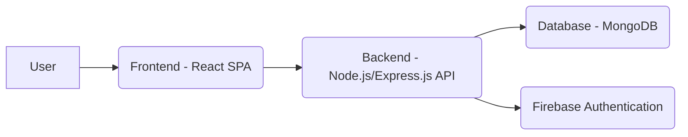

# Finance Tracking SaaS Application - Technical Design Document

## 1. System Architecture

The system will follow a multi-tier architecture, comprising the following components:

- **Frontend:** A React-based single-page application (SPA) responsible for user interface and interaction.
- **Backend:** A Node.js/Express.js API server handling business logic, data validation, and API endpoints.
- **Database:** A NoSQL database (e.g., MongoDB) to store user data, financial transactions, and other application data.
- **Authentication:** Firebase Authentication for user authentication and authorization.

## 2. Database Schema (MongoDB)

- **Users:**
  - `_id`: `ObjectId` (primary key)
  - `uid`: `String` (Firebase UID)
  - `email`: `String`
  - `name`: `String`
  - `createdAt`: `Date`
  - `updatedAt`: `Date`
- **Transactions:**
  - `_id`: `ObjectId` (primary key)
  - `userId`: `ObjectId` (reference to Users)
  - `date`: `Date`
  - `amount`: `Number`
  - `category`: `String`
  - `description`: `String`
  - `type`: `String` (e.g., "income", "expense")
  - `createdAt`: `Date`
  - `updatedAt`: `Date`

## 3. API Endpoints

- **Authentication:**
  - `POST /api/auth/signup`: User signup
  - `POST /api/auth/login`: User login
  - `POST /api/auth/logout`: User logout
- **Users:**
  - `GET /api/users/{id}`: Get user profile
  - `PUT /api/users/{id}`: Update user profile
- **Transactions:**
  - `GET /api/transactions`: Get all transactions for the current user
  - `POST /api/transactions`: Create a new transaction
  - `GET /api/transactions/{id}`: Get a specific transaction
  - `PUT /api/transactions/{id}`: Update a transaction
  - `DELETE /api/transactions/{id}`: Delete a transaction

## 4. Frontend Architecture

The frontend will be built using React and follow a component-based architecture. Key components include:

- **Dashboard:** Main dashboard displaying financial summary, recent transactions, and insights.
- **Transaction List:** Component to display a list of transactions.
- **Transaction Form:** Component to create and update transactions.
- **User Profile:** Component to display and update user profile information.

## 5. Security Considerations

- **Authentication:** Firebase Authentication will be used to handle user authentication and authorization.
- **Authorization:** Role-based access control (RBAC) can be implemented to restrict access to certain resources based on user roles.
- **Data Protection:** Data will be encrypted at rest and in transit using HTTPS. Input validation will be performed on both the frontend and backend to prevent injection attacks.

## 6. Scalability Considerations

- **Horizontal Scaling:** The backend API server can be horizontally scaled by adding more instances behind a load balancer.
- **Vertical Scaling:** The database can be vertically scaled by increasing the resources (CPU, memory, storage) of the database server.
- **Caching:** Caching can be implemented at various levels (e.g., frontend, backend, database) to improve performance and reduce latency.

## 7. Deployment Options

- **Cloud Providers:**
  - **Firebase Hosting:** For hosting the frontend.
  - **Google Cloud Functions/AWS Lambda:** For deploying the backend API server.
  - **MongoDB Atlas:** For hosting the database.
- **Containerization:** Docker can be used to containerize the backend API server for easy deployment and scaling.
- **Orchestration:** Kubernetes can be used to orchestrate the deployment and scaling of the backend API server.
